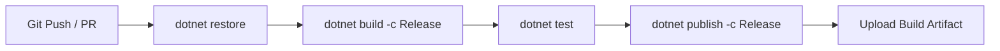

# User Profile Management System (ASP.NET Core 9.0 MVC)

A modern, secure, and production-ready ASP.NET Core MVC web application for managing user profiles, featuring data validation, query optimizations, structured logging, exception handling, xUnit automated testing, and CI/CD deployment pipelines.

---

## Technical Stack & Architecture

- **Framework**: ASP.NET Core 9.0 MVC (C#)
- **Database & ORM**: SQL Server LocalDB & Entity Framework Core 9.0
- **Testing Framework**: xUnit 2.9.2, Moq 4.20.72, EF Core In-Memory DB
- **Frontend**: HTML5, CSS3, Bootstrap 5.3, Bootstrap Icons
- **CI/CD & DevOps**: GitHub Actions Pipeline, Docker Multi-Stage Containerization

---

## Features Implemented Across Weeks

### Week 1: Core Profile CRUD Foundation
- ASP.NET Core MVC architecture with EF Core SQL Server LocalDB database integration.
- Stored user profile attributes: Full Name, Email, Phone Number, Date of Birth, Address, CreatedAt, UpdatedAt.

### Week 2: Professional UI, Validation, EF Performance & Logging
- **Responsive UI/UX**: Card layout with custom avatars, Bootstrap Icons, hover effects, and full mobile responsiveness.
- **Multi-User Profile Switching**: Top profile selector bar with 5 seeded default profiles (**Siva Prakash**, **Priya Sharma**, **Rahul Kumar**, **Ananya Roy**, and **Karthik Raja**).
- **Data Validation**: Custom attribute `[NotInFutureDateAttribute]` preventing future birth dates, regex phone validation, mandatory email formatting.
- **EF Performance**: Applied `.AsNoTracking()` to read-only queries for reduced memory consumption.
- **Logging & Security**: Structured `ILogger` implementation, `[ValidateAntiForgeryToken]` protection, and over-posting defense with `[Bind]`.

### Week 3: Unit & Integration Testing Suite (23 Tests Passed)
- Automated xUnit test suite (`UserProfileManagement.Tests`) with 100% pass rate.
- Coverage includes Custom Date Validation, Model Annotations, Controller Actions, and End-to-End EF Core Lifecycles.

### Week 4: Project Documentation, Docker & CI/CD Pipeline
- Production `.github/workflows/build-test-deploy.yml` GitHub Actions workflow.
- Containerized deployment using multi-stage `Dockerfile` and `.dockerignore`.
- Full project documentation and repeatable deployment guides.

---

## Local Setup & Quick Start Guide

### Prerequisites
- [.NET 9.0 SDK](https://dotnet.microsoft.com/download/dotnet/9.0) installed.
- SQL Server LocalDB installed (included with Visual Studio 2022).

### Installation & Run Steps

1. **Clone or Open the Repository**:
   ```bash
   cd "UserProfileManagement"
   ```

2. **Restore NuGet Packages**:
   ```bash
   dotnet restore UserProfileManagement.sln
   ```

3. **Build the Solution**:
   ```bash
   dotnet build UserProfileManagement.sln
   ```

4. **Run the Automated Test Suite**:
   ```bash
   dotnet test
   ```

5. **Start the Web Application Server**:
   ```bash
   dotnet run
   ```

6. Open your browser and navigate to `http://localhost:5237`.

---

## Automated CI/CD Pipeline

The application includes a GitHub Actions pipeline `.github/workflows/build-test-deploy.yml` that triggers on every push or pull request to `main`:



---

## Docker Container Deployment

To run the application inside a container:

```bash
# Build Docker Image
docker build -t user-profile-management:latest .

# Run Container Instance
docker run -d -p 8080:80 --name user-profile-app user-profile-management:latest
```

Access the containerized app at `http://localhost:8080`.
